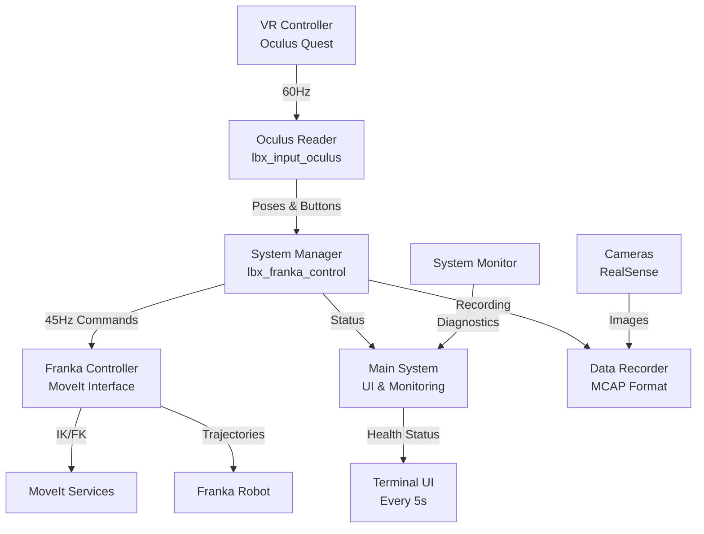

# Labelbox Robotics VR Teleoperation System - Integration Guide

## Overview

The Labelbox Robotics VR Teleoperation System provides high-performance, intuitive control of Franka robots using VR controllers. The system achieves **45Hz control rates** with precise VR-to-robot motion mapping, integrated data recording, and optional camera support.

## System Architecture



## Quick Start

### 1. Basic Teleoperation (Default Settings)

```bash
# Simple start with defaults
./run_teleoperation.sh
```

This will:

- Connect to robot at `192.168.1.59`
- Use right VR controller
- Enable data recording
- Launch RViz visualization
- Use USB VR connection

### 2. Common Configurations

```bash
# Custom robot IP
./run_teleoperation.sh --robot-ip 192.168.1.100

# Enable cameras with recording
./run_teleoperation.sh --cameras

# Network VR mode
./run_teleoperation.sh --network-vr 192.168.1.50

# Left controller, no recording
./run_teleoperation.sh --left-controller --no-recording

# Development mode with hot reload
./run_teleoperation.sh --hot-reload --no-rviz
```

## System Startup Sequence

When you run the system, it follows this sequence:

### 1. **Welcome Screen**

```
╔═══════════════════════════════════════════════════════════════════════╗
║                                                                       ║
║  ██╗      █████╗ ██████╗ ███████╗██╗     ██████╗  ██████╗ ██╗  ██╗  ║
║  ██║     ██╔══██╗██╔══██╗██╔════╝██║     ██╔══██╗██╔═══██╗╚██╗██╔╝  ║
║  ██║     ███████║██████╔╝█████╗  ██║     ██████╔╝██║   ██║ ╚███╔╝   ║
║  ██║     ██╔══██║██╔══██╗██╔══╝  ██║     ██╔══██╗██║   ██║ ██╔██╗   ║
║  ███████╗██║  ██║██████╔╝███████╗███████╗██████╔╝╚██████╔╝██╔╝ ██╗  ║
║  ╚══════╝╚═╝  ╚═╝╚═════╝ ╚══════╝╚══════╝╚═════╝  ╚═════╝ ╚═╝  ╚═╝  ║
║                                                                       ║
║                     R O B O T I C S   S Y S T E M                     ║
║                                                                       ║
╚═══════════════════════════════════════════════════════════════════════╝

🤖 VR-Based Franka Robot Teleoperation System
   High-performance control at 45Hz with MoveIt integration
```

### 2. **Configuration Summary**

Shows current settings:

- VR Mode (USB/Network)
- Control rate (45Hz)
- Camera status
- Recording status
- Robot IP

### 3. **System Initialization**

Performs health checks:

- ✅ VR Controller connectivity
- ✅ Camera tests (if enabled)
- ✅ MoveIt services availability
- ✅ Robot connection

### 4. **Robot Reset**

Automatically moves robot to home position

### 5. **Calibration Mode**

**Forward Direction Calibration:**

1. Hold joystick button
2. Move controller in desired forward direction (>3mm)
3. Release joystick

**Origin Calibration:**

- Press and release grip button to sync VR/robot positions

### 6. **Teleoperation Mode**

Active control with:

- **Grip**: Hold to enable movement
- **Trigger**: Control gripper
- **A/X**: Start/stop recording
- **B/Y**: Mark recording successful

### 7. **Health Monitoring**

Real-time status updates every 5 seconds:

```
[14:32:15] 🎮 VR: Active | 🤖 Robot: OK | 📹 Recording: Active | ⚡ Rate: 45.2Hz
```

## Control Mapping

| VR Input           | Robot Action              |
| ------------------ | ------------------------- |
| Grip Button (Hold) | Enable robot movement     |
| Trigger            | Open/close gripper        |
| A/X Button         | Start/stop recording      |
| B/Y Button         | Mark recording successful |
| Joystick Press     | Calibration mode          |
| Controller Motion  | Robot end-effector motion |

## Performance Optimization

The system is optimized for **45Hz control rate**:

- **VR Processing**: 60Hz internal thread
- **Robot Commands**: 45Hz (optimized from 15Hz)
- **Pose Smoothing**: Adaptive smoothing based on motion speed
- **IK Solving**: 100ms timeout with 10 attempts
- **Trajectory Duration**: 100ms per point

Key parameters in `franka_vr_control_config.yaml`:

```yaml
vr_control:
  control_hz: 60 # VR processing rate
  min_command_interval: 0.022 # 45Hz robot commands
  pose_smoothing_alpha: 0.35 # Smoothing factor

moveit:
  trajectory_duration_single_point: 0.1 # 100ms
  max_joint_velocity: 0.5 # rad/s
  velocity_scale_factor: 0.3 # Tuned for 45Hz
```

## Data Recording

### Automatic Recording

Recording starts/stops via VR buttons (A/X):

- Files saved to `~/lbx_recordings/`
- MCAP format with all sensor data
- Timestamped filenames

### Recording Contents

- VR controller poses and buttons
- **VR calibration transformation matrix** (stored once per file)
- Robot joint states with **torques**
- End-effector poses
- Gripper states
- Intel RealSense camera data:
  - **RGB images** (color stream)
  - **Depth images** (raw and aligned to color frame)
  - **Point clouds** (optional 3D data)
  - Camera calibration (intrinsics for both RGB and depth)
  - Camera **transforms** via TF
- System timestamps

### Successful vs Failed Recordings

- Press B/Y to mark recording as successful
- Successful recordings moved to `success/` subdirectory
- Failed recordings remain in main directory

### Data Verification

When using `--verify-data` flag, the system automatically verifies recordings after completion:

```bash
# Enable verification
./run_teleoperation.sh --verify-data
```

Verification checks for:

- ✓ VR data completeness
- ✓ Robot data including torques
- ✓ VR calibration matrix
- ✓ RGB camera images
- ✓ Depth camera images
- ✓ Point clouds (if enabled)
- ✓ Camera transforms
- ✓ Data synchronization

Results are displayed in the main system UI:

```
📊 Recording Verification Results
──────────────────────────────────────────────────
📁 File: teleoperation_20240115_143022.mcap
📏 Size: 124.5 MB

Data Completeness:
   ✓ VR Data: ✅
   ✓ Robot Data: ✅
   ✓ VR Calibration: ✅
   ✓ Robot Torques: ✅

Camera Data:
   ✓ RGB Images: ✅
   ✓ Depth Images: ✅
   ✓ Point Clouds: ✅
   ✓ Camera Transforms: ✅

✅ All essential data recorded successfully!
```

## Troubleshooting

### VR Controller Not Detected

```bash
# Check USB connection
adb devices

# Restart oculus reader
ros2 launch lbx_input_oculus oculus.launch.py
```

### MoveIt Services Not Available

```bash
# Check robot connection
ping 192.168.1.59

# Verify MoveIt is running
ros2 service list | grep compute_ik
```

### Low Control Rate

- Check CPU usage in health monitor
- Disable cameras if not needed
- Ensure no other heavy processes running

### Calibration Issues

- Move controller >3mm during calibration
- Ensure grip button fully pressed/released
- Check for VR tracking issues

## Advanced Configuration

### Network VR Mode

For wireless VR operation:

1. Configure Oculus app on Quest for network mode
2. Note the IP address shown
3. Run: `./run_teleoperation.sh --network-vr <IP>`

### Camera Configuration

Create custom camera config:

```yaml
# camera_config.yaml
cameras:
  wrist_camera:
    serial: "123456"
    fps: 30
    resolution: [640, 480]
  overhead_camera:
    serial: "789012"
    fps: 15
    resolution: [1920, 1080]
```

Run with: `./run_teleoperation.sh --cameras --camera-config path/to/config.yaml`

### Performance Tuning

For maximum performance:

```bash
# Disable visualization and recording
./run_teleoperation.sh --no-rviz --no-recording

# Use performance CPU governor
sudo cpupower frequency-set -g performance
```

## System Requirements

- **ROS2**: Humble or newer
- **MoveIt2**: Configured for Franka
- **Hardware**:
  - Franka FR3 robot
  - Oculus Quest 2/3
  - Ubuntu 22.04 or newer
  - 8GB+ RAM recommended

## Safety Considerations

⚠️ **Important Safety Notes:**

1. **Emergency Stop**: Keep E-stop within reach
2. **Workspace**: Ensure clear workspace around robot
3. **Calibration**: Always calibrate before operation
4. **Speed Limits**: Default settings include safety limits
5. **Gripper Force**: Limited to 60N by default

## Development

### Hot Reload Mode

For development without restarting:

```bash
./run_teleoperation.sh --hot-reload
```

### Monitoring Topics

```bash
# VR input
ros2 topic echo /vr/controller_pose
ros2 topic echo /vr/controller_buttons

# System status
ros2 topic echo /system_status
ros2 topic echo /diagnostics

# Robot state
ros2 topic echo /joint_states
```

### Performance Analysis

```bash
# Check control loop timing
ros2 topic hz /joint_states

# Monitor system resources
htop

# Analyze recordings
mcap info ~/lbx_recordings/latest.mcap
```

## Integration with External Systems

The system publishes standard ROS2 topics that can be consumed by other nodes:

- `/vr_control_state`: Current VR controller state
- `/system_status`: Overall system status
- `/recording_status`: Recording state
- `/diagnostics`: Detailed health information

Subscribe to these topics for custom integrations or monitoring dashboards.

## Support

For issues or questions:

1. Check troubleshooting section
2. Review system logs: `ros2 topic echo /rosout`
3. Verify configuration in `franka_vr_control_config.yaml`
4. Contact: robotics@labelbox.com
